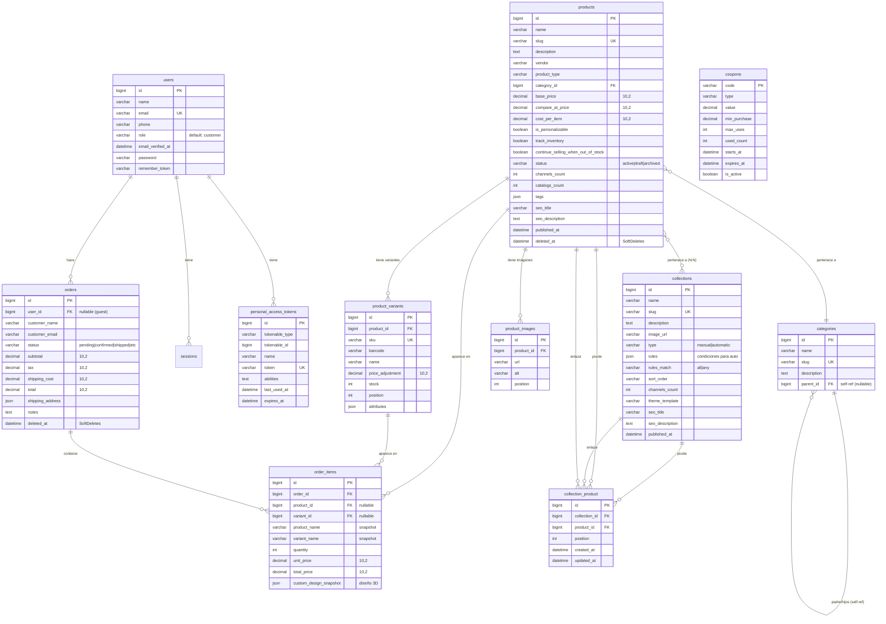

# Diagrama Entidad-Relación — TAP-alpha Backend

## Leyenda

| Símbolo | Significado |
|---|---|
| `PK` | Primary Key |
| `FK` | Foreign Key |
| `UK` | Unique |
| `SoftDeletes` | Borrado lógico (`deleted_at`) |
| `N:N` | Relación muchos a muchos (usa pivote) |

## Integridad Referencial (ON DELETE)

| Tabla hija | Columna | Tabla padre | ON DELETE |
|---|---|---|---|
| `products` | `category_id` | `categories.id` | `SET NULL` |
| `product_variants` | `product_id` | `products.id` | `CASCADE` |
| `product_images` | `product_id` | `products.id` | `CASCADE` |
| `categories` | `parent_id` | `categories.id` | `SET NULL` |
| `collection_product` | `collection_id` | `collections.id` | `CASCADE` |
| `collection_product` | `product_id` | `products.id` | `CASCADE` |
| `orders` | `user_id` | `users.id` | `SET NULL` |
| `order_items` | `order_id` | `orders.id` | `CASCADE` |
| `order_items` | `product_id` | `products.id` | `SET NULL` |
| `order_items` | `variant_id` | `product_variants.id` | `SET NULL` |

## Notas

- **SoftDeletes**: Solo `products` y `orders` usan borrado lógico.
- **Coupon** no tiene relaciones FK; usa `applies_to_type` + `applies_to_ids` (JSON) para definir su alcance.
- **OrderItems** desnormaliza `product_name` y `variant_name` como snapshot histórico al momento de la compra.
- **collection_product** tiene constraint `UNIQUE(collection_id, product_id)` — un producto solo puede estar una vez en una colección.
- Las colecciones `automatic` resuelven dinámicamente sus productos vía `rules` (JSON) + `rules_match` (`all`/`any`), no requieren entradas en `collection_product`.
